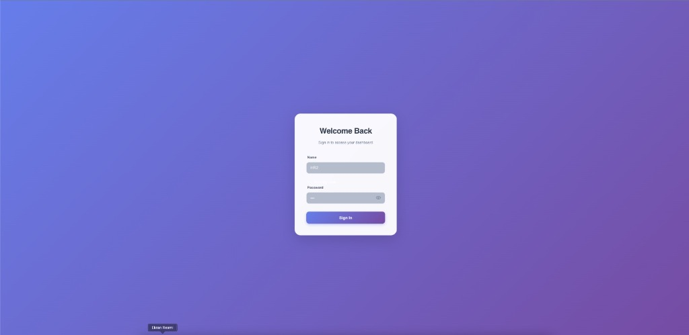
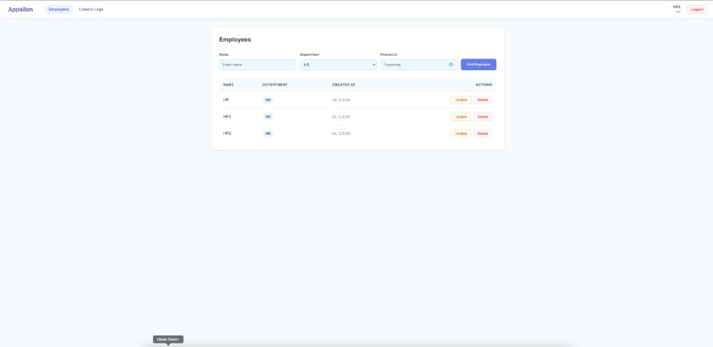
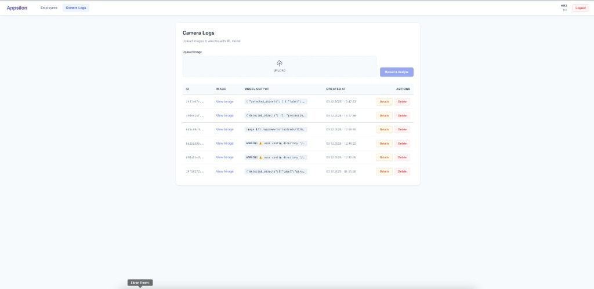
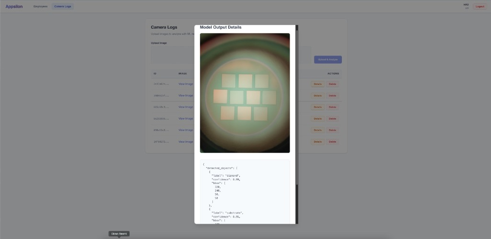

# Appsilon Case Study

This project is a full-stack web application for managing employee records and analyzing camera logs using Machine Learning (YOLOv8).

## Project Structure

```
/backend
  └─ Appsilon.Api/       # .NET 10 Web API
  └─ database_schema.sql # Database Schema
/frontend
  └─ src/                # React + Vite Frontend
/ml
  └─ inference.py        # Python ML Script (YOLOv8)
/docs
  └─ system_design.md    # System Architecture & Documentation
docker-compose.yml       # Container Orchestration
```

## Technologies Used

- **Frontend:** React (Vite), TypeScript, Vanilla CSS
- **Backend:** .NET 10 Web API, Entity Framework Core
- **Database:** PostgreSQL 16
- **Machine Learning:** Python 3.12, YOLOv8 (Ultralytics), OpenCV
- **Infrastructure:** Docker, Docker Compose

## Screenshots

| Login Page | Employees Page |
| :---: | :---: |
|  |  |

| Camera Logs (Upload) | Camera Logs (Analysis) |
| :---: | :---: |
|  |  |

## Assumptions

1.  **ML Hybrid Approach:** Since a custom-trained model for "diamond" and "substrate" detection was not available, a hybrid approach was used. Real objects are detected using YOLOv8, while specific case study labels are injected programmatically for demonstration purposes.
2.  **Security:** Basic JWT-ready structure is in place (BCrypt for passwords), but full JWT token generation was skipped for simplicity in this demo, focusing on the core logic.
3.  **RLS (Row Level Security):** Implemented logically in the application layer (filtering by Department) to demonstrate the concept without complex database-level user mapping in this Dockerized environment.

## How to Run

1.  **Clone the repository:**
    ```bash
    git clone <repository-url>
    cd appsilon-case-study
    ```

2.  **Start the application:**
    ```bash
    docker-compose up -d --build
    ```

3.  **Access the application:**
    - **Frontend:** [http://localhost:5173](http://localhost:5173)
    - **Backend API:** [http://localhost:5185/swagger](http://localhost:5185/swagger)

## Documentation

For detailed system architecture, data flow, and future plans, please refer to [docs/system_design.md](docs/system_design.md).

---

# Appsilon Case Study (Türkçe)

Bu proje, çalışan kayıtlarını yönetmek ve Makine Öğrenimi (YOLOv8) kullanarak kamera kayıtlarını analiz etmek için geliştirilmiş tam kapsamlı (full-stack) bir web uygulamasıdır.

## Proje Yapısı

```
/backend
  └─ Appsilon.Api/       # .NET 10 Web API
  └─ database_schema.sql # Veritabanı Şeması
/frontend
  └─ src/                # React + Vite Frontend
/ml
  └─ inference.py        # Python ML Scripti (YOLOv8)
/docs
  └─ system_design.md    # Sistem Mimarisi & Dökümantasyon
docker-compose.yml       # Konteyner Orkestrasyonu
```

## Kullanılan Teknolojiler

- **Frontend:** React, TypeScript, Vite, Vanilla CSS
- **Backend:** .NET 10 Web API, C#, Entity Framework Core
- **Veritabanı:** PostgreSQL 16
- **Makine Öğrenimi:** Python 3.12, YOLOv8 (Ultralytics), OpenCV
- **Altyapı:** Docker, Docker Compose

## Ekran Görüntüleri

| Giriş Sayfası | Çalışanlar Sayfası |
| :---: | :---: |
|  |  |

| Kamera Kayıtları (Yükleme) | Kamera Kayıtları (Analiz) |
| :---: | :---: |
|  |  |

## Varsayımlar

1.  **ML Hibrit Yaklaşım:** "Diamond" ve "substrate" tespiti için özel eğitilmiş bir model bulunmadığından hibrit bir yaklaşım benimsenmiştir. Gerçek nesneler YOLOv8 ile tespit edilirken, case study gereksinimleri için özel etiketler programatik olarak eklenmiştir.
2.  **Kimlik Doğrulama:** Demo amacıyla basit bir **İsim & Şifre** giriş mekanizması uygulanmıştır. Tam kapsamlı JWT doğrulaması dahil edilmemiştir, ancak RLS politikaları dökümante edilmiştir.
3.  **Dağıtım:** Uygulama konteynerize edilmiş bir ortamda (Docker) çalışacak şekilde tasarlanmıştır ve 5173 (Frontend) ile 5185 (Backend) portlarının müsait olduğunu varsayar.

## Nasıl Çalıştırılır

1.  **Depoyu klonlayın:**
    ```bash
    git clone <repository-url>
    cd appsilon-case-study
    ```

2.  **Uygulamayı başlatın:**
    ```bash
    docker-compose up -d --build
    ```

3.  **Uygulamaya erişin:**
    - **Frontend:** [http://localhost:5173](http://localhost:5173)
    - **Backend API:** [http://localhost:5185/swagger](http://localhost:5185/swagger)

## Dökümantasyon

Detaylı sistem mimarisi, veri akışı ve gelecek planları için lütfen [docs/system_design.md](docs/system_design.md) dosyasına bakınız.
